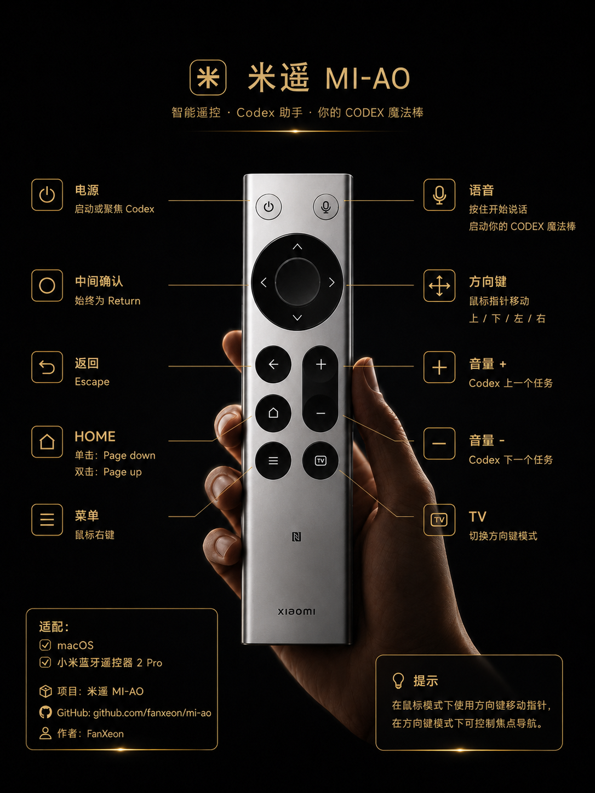

<!-- Copyright (c) 2026 FanXeon@Poemcoder with Codex -->

# 米遥 MI-AO

<p align="center">
  
</p>

**在 Vibe Coding 时代，把小米蓝牙遥控器 2 Pro 变成 Mac 上一根真正握在手里的 Codex 魔法仙女棒。**

**仅适用于 macOS 14 或更高版本，当前不支持 Windows / Linux。** 按住说话，松手发送。本地 Whisper 完成转写，Codex 立即开工。

由 **FanXeon@Poemcoder with Codex** 创建、真机验证并持续维护。“是的我只手写了这一行代码，出现任何bug我宣布有codex负责”

[中文](README.md) · [English](README_EN.md) · [配对与连接](docs/PAIRING.md) · [3 分钟快速开始](docs/QUICKSTART.md) · [按键预设](docs/BUTTON_PRESETS.md) · [使用说明](docs/USAGE.md) · [兼容设备](docs/COMPATIBILITY.md) · [参与贡献](CONTRIBUTING.md)

[](https://github.com/fanxeon/mi-ao/actions/workflows/ci.yml)
[](LICENSE)
[](Package.swift)
[](Package.swift)
[](docs/COMPATIBILITY.md)

```text
按住遥控器 → 说“检查当前项目并继续工作” → 松手 → Codex 开工
```

米遥是为 macOS 构建的小米蓝牙遥控器 2 Pro → Codex 语音输入方案。它直接读取遥控器自带麦克风的 BLE 语音数据，在 Mac 上本地解码和转写，然后安全发送到当前 Codex 任务。它不是另一个 Mac 麦克风听写工具；它让抽屉里的语音遥控器成为一个有手感、拿起就能用的 Vibe Coding 入口。

> **真机状态：** 小米蓝牙遥控器 2 Pro（固件 2671）已完成从按住说话到 Codex 真实收到消息的端到端验证。

## 运行环境与项目内容

| 项目 | 当前要求 / 已实现内容 |
| --- | --- |
| 操作系统 | **macOS 14+**；当前不支持 Windows / Linux |
| 已验证硬件 | 小米蓝牙遥控器 2 Pro，固件 2671，通过 Bluetooth Low Energy 连接 |
| 目标应用 | Codex macOS App（bundle ID `com.openai.codex`） |
| 本地工具链 | Swift 6.0+、Xcode Command Line Tools、Homebrew、`whisper.cpp` |
| 系统权限 | 蓝牙用于读取遥控器；辅助功能用于验证 Codex 输入区并执行按键动作 |
| 语音链路 | ATVV v0.4 / v1.0 → ADPCM 解码 → 本地 Whisper 转写 → Codex |
| 按键控制 | 方向环可切换“移动指针 / 上下左右”，确认固定 Return，返回固定 Escape |
| 调试与安全 | 内置固件 2671 真机档案，本地校准可安全覆盖；接管前先验证权限与运行时，退出时自动恢复 |
| 交付形态 | **source-first alpha**；一条命令本地构建并打开设置向导，菜单栏 GUI 显示真实状态和安全操作 |

首次安装需要联网安装 `whisper-cpp` 并下载多语言 base 模型；日常语音转写在本机完成。详细安装路径见 [3 分钟快速开始](docs/QUICKSTART.md)，已实现与计划中功能的边界见 [路线图](docs/ROADMAP.md)。

## 为什么它像一根真正的魔法仙女棒

- **一个动作。** 按住就说，松手就发，不用先找麦克风按钮。
- **硬件麦克风。** 语音来自遥控器本身，不是用 MacBook 麦克风做假入口。
- **本地语音链路。** ADPCM 解码和 `whisper.cpp` 转写都在本机完成。
- **说完立刻可继续。** 转写和提交进入串行后台队列，不阻塞 BLE、方向键或下一段录音。
- **默认不误发。** 只有当前 Codex 辅助功能树确认唯一可用输入区时才发送；其他情况只复制文字。
- **状态一直可见。** 点击菜单栏图标可查看搜索、连接、录音、后台转写和发送结果，并可聚焦 Codex、打开记录、复查环境或安全退出。
- **面向兼容性贡献。** 内置脱敏 GATT 采集模式，可以用真实证据接入更多遥控器。
- **开箱可用，也可重新校准。** 已验证的小米 2 Pro 直接使用仓库内置硬件档案；调试模式仍可生成本地覆盖，不采集 Mac 键盘输入，也不合成鼠标或键盘动作。

## 真实闭环证据

```text
AUDIO_START ADPCM 16 kHz
AUDIO_STOP reason=remote-release
转写：请回复米遥真实发送成功。
已发送到 Codex
```

真实硬件、协议和端到端验收记录见 [兼容性矩阵](docs/COMPATIBILITY.md) 和 [真机 Bring-up](docs/HARDWARE_BRINGUP.md)。

## 一支遥控器，多套映射

硬件档案只识别实体按钮，映射套装决定按钮用途。固件 2671 默认加载仓库内置的十二键真机档案；本地人工校准按时间覆盖该基线。默认 `pointer` 套装同时覆盖指针控制和 Codex 会话导航，未来更换套装也无需重新校准硬件。

> **模式不变量：** `TV` 只切换方向环的“移动指针 / 上下左右”。确认、返回、HOME、音量、语音、电源和菜单在两种模式下完全相同。

| 按钮 | 默认 `pointer` 动作 |
| --- | --- |
| 方向环 | 鼠标模式：移动指针；方向键模式：发送上下左右 |
| 中间确认 | 固定发送 Return |
| 返回 | 固定发送 Escape |
| 音量 `+` / `-` | Codex 上一个 / 下一个会话 |
| `TV` | 切换鼠标模式 / 方向键模式 |
| `HOME` | 单击 Page Down；350 ms 内双击 Page Up |
| 菜单 | 鼠标右键（沿用 macOS 原生行为） |
| 语音 | 保持原有按住说话 |
| 电源 | 启动 Codex；已运行时聚焦 |

> **状态边界：** 映射架构、双控制模式和执行器已经实现；小米 2 Pro 固件 2671 的方向四键、确认、返回、HOME、TV、电源、语音和音量加减均已按新格式人工确认。米遥接管这十二键并拦截原生副作用；菜单不进入米遥映射，沿用 macOS 原生鼠标右键。音量加减切换 Codex 会话已完成双向真机验收；HOME 单/双击、模式切换和电源动作仍需逐项验收。



<p align="center"><sub>米遥 MI-AO 默认按键示意图 · FanXeon@Poemcoder with Codex</sub></p>

> 图中的“菜单＝鼠标右键”来自 macOS 对该遥控器的原生行为，米遥不会重映射或拦截菜单键。

完整示意图、校准命令、安全回退和扩展合同见 [按键预设与默认指针模式](docs/BUTTON_PRESETS.md)。

## 3 分钟快速开始

### 1. 安装

```bash
git clone https://github.com/fanxeon/mi-ao.git
cd mi-ao
./scripts/setup.sh
```

`setup.sh` 会安装 `whisper-cpp`、下载多语言 base 模型、构建 release App、安装到 `~/Applications/米遥.app`，然后自动打开米遥设置向导。首次安装只需要这一条项目命令。

当前 source-first alpha 使用安全的 ad-hoc 签名。源码更新改变 App 二进制后，macOS 可能仍把旧“米遥”显示为已开启，但当前构建尚未继承辅助功能权限；向导会明确提示移除旧条目并重新添加当前 App，并自动刷新状态。项目不会用仅匹配 Bundle ID 的宽松签名规则绕过 TCC。

### 2. 跟随设置向导

向导会逐项检查 macOS、Whisper 与模型、米遥辅助功能、蓝牙、Codex 输入区和安全启动组件。按卡片按钮完成系统授权；点击“配对遥控器”后，在小米蓝牙遥控器 2 Pro 上**同时长按菜单键 + `HOME`**，在系统蓝牙中点击“连接”。

如果 Codex 正在工作但没有本次进程兼容参数，向导只会提示“准备 Codex”，不会擅自重启；只有你明确确认后才重启一次。该参数不修改 Codex 偏好设置、不开放调试端口，退出 Codex 后即失效。完整流程见 [遥控器配对与首次连接指南](docs/PAIRING.md)。

### 3. 启动

全部检查通过后，在向导中点击“连接遥控器并开始”。也可以从项目目录使用等价的命令行入口：

```bash
./scripts/start.sh
```

向导和脚本共用同一条后台启动门禁：确认权限和按键运行时可用后，才从内置硬件档案生成十二键 `No Event` 映射；检查失败时不会修改系统。菜单继续作为系统鼠标右键。点击菜单栏图标可打开 GUI，“安全退出并恢复遥控器”会等待当前语音处理完成再退出并恢复原映射，也可运行 `./scripts/stop.sh`。

日常启动不会打断正在工作的 Codex：Codex 未运行时自动带本次进程兼容参数启动；Codex 已运行但缺少参数时，米遥会在修改遥控器映射前停止并提示，绝不会擅自重启。`--no-submit` 安全转写模式不需要 Codex 兼容参数。

只使用语音、完全不修改系统映射：

```bash
./scripts/run.sh --name "小米蓝牙语音遥控器" --no-buttons
```

其他遥控器请先按 [快速开始](docs/QUICKSTART.md) 采集脱敏协议证据，不要盲猜 UUID。

安装完成后可随时双击 `~/Applications/米遥.app` 重新打开设置向导；真正启动仍必须通过向导的检查按钮，因此不会绕过按键门禁。菜单栏 GUI、连续语音、仅转写模式、项目术语、更新和数据清理见 [完整使用说明](docs/USAGE.md)。

## 兼容性

| 设备 | 固件 | 协议 | 端到端 |
| --- | --- | --- | --- |
| 小米蓝牙遥控器 2 Pro | 2671 | ATVV v1.0 · ADPCM 16 kHz · 120 B | ✅ macOS → Whisper → Codex |
| 其他 Google / Android TV 语音遥控器 | 待贡献 | ATVV v0.4 / v1.0 参考实现 | 🧪 需要真机证据 |

完整状态、证据等级和新设备贡献方式见 [docs/COMPATIBILITY.md](docs/COMPATIBILITY.md)。

## 工作原理

```text
BLE 遥控器
  → Google ATV Voice over BLE
  → IMA/DVI ADPCM
  → 16 kHz PCM / WAV
  → 本地 whisper.cpp
  → Codex 当前进程的 Accessibility 树
  → 唯一可用的 Codex 输入区
```

当前支持 ATVV v0.4 / v1.0、8 kHz / 16 kHz ADPCM、`AUDIO_STOP`、二次按键与静音超时收口。模块边界和扩展方式见 [架构说明](docs/ARCHITECTURE.md) 和 [ATVV 协议说明](docs/PROTOCOL.md)。

实体按键采用另一条链路：`HID Usage → 内置真机档案 / 本地校准覆盖 → 可切换预设 → 动作执行器`。硬件档案不保存鼠标或 Codex 动作，因此更换预设不会污染设备证据。

## 隐私与安全

- 语音转写默认在本机完成，不依赖语音云 API。
- WAV 和 transcript 保存在本机 `~/Library/Application Support/mi-ao/recordings`，用于用户复核。
- 录音目录权限收紧为当前用户可访问，WAV 和 transcript 文件使用 `0600`；不会自动上传。
- 提交期间若用户复制了新内容，米遥检测到剪贴板已变化后不会用旧内容覆盖它。
- 转写为空、Codex 未运行、权限不足或编辑器不唯一时，不会自动发送。
- Codex 兼容参数只公开当前进程的辅助功能树，不开启调试端口，不修改 Codex 偏好设置；文本仍由受保护的剪贴板链路粘贴。
- 采集报告默认哈希化设备 UUID 并隐藏名称，但原始 GATT payload 仍须在分享前人工复核。

完整边界见 [SECURITY.md](SECURITY.md)。

## 项目状态

核心真机链路已打通，当前是 **source-first alpha**：用户在自己的 Mac 上构建并使用 ad-hoc 签名 App。没有 Apple Developer ID 时，项目不会把未公证 DMG 包装成“一键安装”。

已经补齐首次设置向导、菜单栏 GUI、安全后台启停、重复实例门禁、非阻塞转写队列和剪贴板并发保护。下一阶段聚焦：

- 设备选择、配置持久化与自动重连；
- 默认 pointer 套装的模式切换、电源动作和多显示器定位体验验收；
- Codex 会话导航等第二套映射；
- 更多真实遥控器的兼容矩阵；
- 可配置输出目标，但不弱化默认安全边界。

见 [路线图](docs/ROADMAP.md) 和 [源码优先分发](docs/DISTRIBUTION.md)。

## 参与贡献

最有价值的贡献是“新硬件的可复核证据”。你可以：

- 提交一份脱敏 GATT 采集，帮助兼容新遥控器；
- 改进 ADPCM / ATVV 协议适配与测试 fixture；
- 完善设备选择、自动重连反馈和开机自启；
- 改进中英文文档、排错和隐私审查。

请先阅读 [CONTRIBUTING.md](CONTRIBUTING.md)。没有真机证据的兼容性声明不会合并。

## 文档

- [文档导航](docs/README.md)
- [遥控器配对与首次连接](docs/PAIRING.md)
- [快速开始](docs/QUICKSTART.md)
- [完整使用说明](docs/USAGE.md)
- [按键预设与默认指针模式](docs/BUTTON_PRESETS.md)
- [兼容性矩阵](docs/COMPATIBILITY.md)
- [故障排查](docs/TROUBLESHOOTING.md)
- [架构说明](docs/ARCHITECTURE.md)
- [ATVV 协议说明](docs/PROTOCOL.md)
- [真机 Bring-up](docs/HARDWARE_BRINGUP.md)
- [路线图](docs/ROADMAP.md)

## 作者、致谢与许可证

米遥由 **FanXeon@Poemcoder with Codex** 创建。产品方向、工程决策、真实硬件验证与维护由 FanXeon@Poemcoder 负责，Codex 作为 AI 工程协作者参与代码、测试、文档与调试。完整版权和法律边界见 [NOTICE](NOTICE)。

米遥基于 Google ATV Voice over BLE 协议调研，使用 [`whisper.cpp`](https://github.com/ggml-org/whisper.cpp) 完成本地转写。协议参考和第三方声明见 [THIRD_PARTY_NOTICES.md](THIRD_PARTY_NOTICES.md)。

代码采用 [MIT License](LICENSE)，统一版权署名为 `Copyright (c) 2026 FanXeon@Poemcoder with Codex`。“米遥 / MI-AO”是独立开源项目，并非小米、Google 或 OpenAI 官方产品，也不受其背书。

---

如果你也相信 Vibe Coding 应该有一根真正握在手里的魔法仙女棒，欢迎 Star，并告诉我们下一款应该点亮哪支遥控器。
