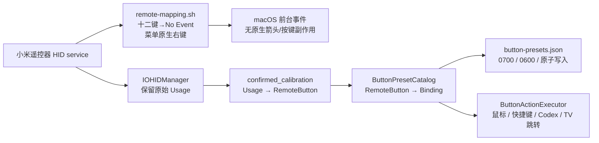

<!-- Copyright (c) 2026 FanXeon@Poemcoder with Codex -->

# 架构说明

## 目标链路

```text
BLE 遥控器
  -> CoreBluetooth transport
  -> ATVV session/protocol
  -> IMA/DVI ADPCM decoder
  -> PCM gain + 16 kHz resampling
  -> serial background speech queue
  -> local whisper.cpp
  -> Codex process accessibility tree
  -> verified Codex text input + clipboard change guard
```

## 实体按键链路



硬件档案与动作预设是两个独立合同。`ButtonProfileStore` 只合并人工确认且与设备 Vendor/Product 一致的物理映射；`ButtonPresetCatalog` 决定当前动作。默认 `pointer` 缺少方向四键、确认或返回中任一必需项，或发现两个按钮共用同一 Usage 时，运行时拒绝启动实体按键动作，语音桥接不受影响。用户方案存于 `button-presets.json`；默认方案只读，用户方案通过 `ButtonBinding` 表达内置动作、标准键盘快捷键或 TV 到另一方案的显式跳转。

## 模块边界

- `BLEVoiceBridge.swift`：设备发现、连接、GATT 枚举、通知和语音会话状态机。
- `CaptureRecorder.swift`：结构化真机证据、设备身份脱敏、原始事件和采集摘要。
- `ATVVProtocol.swift`：协议常量、capabilities、控制消息和帧解析。
- `ADPCMDecoder.swift`：无平台依赖的 IMA/DVI ADPCM 解码。
- `AudioPipeline.swift`：RMS、增益、重采样和 WAV 编码。
- `WhisperTranscriber.swift`：本地 `whisper-cli` 进程合同。
- `SpeechJobQueue.swift`：最多两条任务的串行后台队列、唯一文件名、私有文件权限，以及有序转写/提交。
- `CodexSubmitter.swift`：Codex 进程识别、Accessibility 唯一编辑器发现与聚焦、带兼容参数的启动、非阻塞粘贴/发送和剪贴板并发变化保护。
- `SetupEnvironment.swift` / `SetupGuideWindowController.swift`：首次设置的六项真实环境检查、系统授权入口、安装来源合同，以及通过既有启动门禁开始运行；不自行伪造授权、配对或连接成功。
- `MenuBarController.swift`：状态图标与轻量 popover GUI；显示连接、录音、处理、提交和错误状态，并提供聚焦 Codex、打开记录、设置诊断和安全退出入口。
- `ButtonLearner.swift` / `ButtonProfile.swift`：HID 学习、人工确认和脱敏物理按键档案。
- `ButtonPreset.swift` / `ButtonPresetStore.swift`：与硬件无关的映射套装、`KeyboardShortcutSpec`、TV 跳转规则和私有方案库；内置默认 `pointer` 永远只读，损坏配置隔离后安全回退。
- `ButtonProfileStore.swift`：合并确认档案、检查六键完整性和 Usage 冲突。
- `HIDButtonController.swift`：运行期 HID 事件到实体按钮的分发，并将 TV 方案切换持久化为当前选择。
- `ButtonActionExecutor.swift`：鼠标移动、方向键/Return/Escape、受控快捷键按下/释放、模式切换、TV 方案跳转，以及 Codex 启动、聚焦和上/下一个会话。
- `remote-mapping.sh` / `run-with-mapping.sh`：十二个接管键到 HID `No Event` 的设备专属中性化；菜单不进入映射并沿用 macOS 原生鼠标右键。包含 v1/v2/v3 迁移、单实例锁、所有权状态、回读验证和退出恢复。
- `start.sh` / `stop.sh`：日常后台启停；运行锁记录真实 App PID，菜单退出、命令停止和外层包装器都会触发同一所有权校验恢复。即使启动终端或包装器意外消失，App 的正常退出路径仍会恢复映射。
- `Configuration.swift`：CLI 模式和安全选项；显式 `setup` 或双击 App 进入向导，显式 `run` 才进入桥接运行时。

`build-app.sh` 会把最小日常运行根封装到 `Contents/Resources/Runtime`：固定白名单启停脚本、Codex 兼容门禁、按键检查与映射恢复、语音引擎修复、版本以及硬件档案。这些文件随 App 一起参与代码签名，GUI 只调用当前 Bundle 内的固定脚本，不接受任意命令文本。

`setup.sh` 安装时以 `0600` 写入 `install-context.plist`，记录 `runtimeRoot`、版本、签名指纹与可选 `repositoryRoot`。新版 App 优先从 `Bundle.main` 定位内置 Runtime，所以 App 或源码目录移动后日常运行仍不会落回任意外部路径；旧版仅含 `repositoryRoot` 的上下文仍可解析。GUI 和命令行继续共用 `run-with-mapping.sh`、`check-buttons`、单实例锁和退出恢复合同。

米遥不建立全局 Quartz 键盘事件 tap，也不按时间窗口猜测事件来源。Mac 实体键盘不会进入米遥的按键处理链；遥控器原生副作用只由精确匹配该 HID service 的十二键 `No Event` 映射隔离。HOME 的单/双击仲裁只在已确认的遥控器 HOME 事件上运行。

## 会话状态

```text
disconnected -> discovering -> ready -> opening -> streaming -> ready
                                                   |-> background queue: wav -> whisper -> submit
```

录音帧离开主线程后立即回到 `ready`，因此上一条正在转写时仍能接收按键和下一段语音。队列最多容纳一条处理中和一条等待中，第三条明确拒绝而不是无限积压。安全退出会等待已接收任务完成。失败不会伪造成功：协议错误会终止当前进程；单次转写或提交失败会保留本地文件并在菜单栏显示原因。

当前 Codex 默认不把网页输入区暴露为完整 AX 控件树。`codex-accessibility.sh` 使用 Codex 自带 Chromium 的 `--force-renderer-accessibility` 参数启动当前进程；它不修改偏好设置、不开放调试端口，退出后自然失效。公开控件树后，米遥仍要求活动窗口中恰好存在一个可用 `AXTextArea`，否则只复制 transcript 而不回车。

`capture` 与 `run` 使用同一套 CoreBluetooth 回调，但行为边界不同：`capture` 可以连接未知协议、读取可读特征并订阅全部 notify/indicate，却不会向未知 characteristic 写入数据；只有识别到标准 ATVV UUID 后才复用已知能力协商。

## 扩展新协议

若小米 2 Pro 不暴露 ATVV UUID，应新增 transport/protocol 适配器，而不是把小米私有帧塞进 `ATVVProtocol`。音频层之后的 Whisper 和 Codex 提交链路应保持复用。
