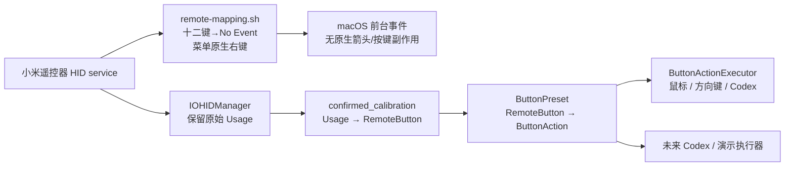

<!-- Copyright (c) 2026 FanXeon@Poemcoder with Codex -->

# 架构说明

## 目标链路

```text
BLE 遥控器
  -> CoreBluetooth transport
  -> ATVV session/protocol
  -> IMA/DVI ADPCM decoder
  -> PCM gain + 16 kHz resampling
  -> local whisper.cpp
  -> verified Codex text input
```

## 实体按键链路



硬件档案与动作预设是两个独立合同。`ButtonProfileStore` 只合并人工确认且与设备 Vendor/Product 一致的物理映射；`ButtonPreset` 决定当前动作。默认 `pointer` 缺少方向四键、确认或返回中任一必需项，或发现两个按钮共用同一 Usage 时，运行时拒绝启动实体按键动作，语音桥接不受影响。

## 模块边界

- `BLEVoiceBridge.swift`：设备发现、连接、GATT 枚举、通知和语音会话状态机。
- `CaptureRecorder.swift`：结构化真机证据、设备身份脱敏、原始事件和采集摘要。
- `ATVVProtocol.swift`：协议常量、capabilities、控制消息和帧解析。
- `ADPCMDecoder.swift`：无平台依赖的 IMA/DVI ADPCM 解码。
- `AudioPipeline.swift`：RMS、增益、重采样和 WAV 编码。
- `WhisperTranscriber.swift`：本地 `whisper-cli` 进程合同。
- `CodexSubmitter.swift`：Codex 进程识别、Electron 可访问性树遍历、唯一编辑器聚焦，以及语音文字的粘贴和发送。
- `ButtonLearner.swift` / `ButtonProfile.swift`：HID 学习、人工确认和脱敏物理按键档案。
- `ButtonPreset.swift`：与硬件无关的映射套装；当前内置默认 `pointer`。
- `ButtonProfileStore.swift`：合并确认档案、检查六键完整性和 Usage 冲突。
- `HIDButtonController.swift`：运行期 HID 事件到实体按钮的分发。
- `ButtonActionExecutor.swift`：鼠标移动、方向键/Return/Escape、模式切换，以及 Codex 启动、聚焦和上/下一个会话。
- `remote-mapping.sh` / `run-with-mapping.sh`：十二个接管键到 HID `No Event` 的设备专属中性化；菜单不进入映射并沿用 macOS 原生鼠标右键。包含 v1/v2/v3 迁移、所有权状态、回读验证和退出恢复。
- `Configuration.swift`：CLI 模式和安全选项。

米遥不建立全局 Quartz 键盘事件 tap，也不按时间窗口猜测事件来源。Mac 实体键盘不会进入米遥的按键处理链；遥控器原生副作用只由精确匹配该 HID service 的十二键 `No Event` 映射隔离。HOME 的单/双击仲裁只在已确认的遥控器 HOME 事件上运行。

## 会话状态

```text
disconnected -> discovering -> ready -> opening -> streaming -> transcribing -> ready
```

失败不会伪造成功：协议错误会终止当前进程；单次转写或提交失败会保留录音并回到 `ready`。

`capture` 与 `run` 使用同一套 CoreBluetooth 回调，但行为边界不同：`capture` 可以连接未知协议、读取可读特征并订阅全部 notify/indicate，却不会向未知 characteristic 写入数据；只有识别到标准 ATVV UUID 后才复用已知能力协商。

## 扩展新协议

若小米 2 Pro 不暴露 ATVV UUID，应新增 transport/protocol 适配器，而不是把小米私有帧塞进 `ATVVProtocol`。音频层之后的 Whisper 和 Codex 提交链路应保持复用。
