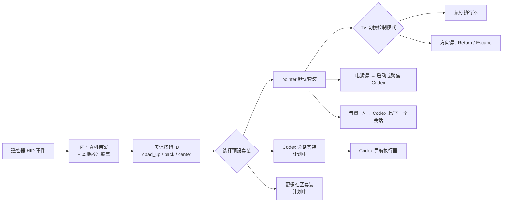

<!-- Copyright (c) 2026 FanXeon@Poemcoder with Codex -->

# 按键预设与默认指针模式

[English](BUTTON_PRESETS_EN.md) · [返回使用说明](USAGE.md) · [路线图](ROADMAP.md)

米遥把硬件识别和用户偏好分成两层：内置真机档案或本地校准只回答“这个 HID Usage 是哪个实体按钮”，预设套装再决定“这个按钮现在做什么”。更换套装不需要重新校准遥控器。

> 当前状态：`pointer` 默认套装、校准合并、冲突拒绝和鼠标执行器已经实现并通过自动测试；小米 2 Pro 固件 2671 的十二个接管键已完成新格式真机校准，四个方向已验证直接光标定位与真实坐标变化，音量加减已完成 Codex 会话双向切换验收。HOME 单/双击、模式切换和电源动作仍需逐项验收。

## 映射架构



校准档案不会保存 `keyboard.escape` 一类动作。返回键在硬件层永远只是 `back`；默认套装再将它解释为 Escape。

## 默认套装与两种控制模式

| 实体按钮 | 默认动作 | 当前门禁 |
| --- | --- | --- |
| 语音键 | `voice.push_to_talk` | 继续使用已验证 ATVV 语音链路 |
| 方向上 / 下 / 左 / 右 | 鼠标：`pointer.move_*`；方向键：`keyboard.arrow_*` | 固件 2671 内置已确认 Usage |
| 中间确认键 | 固定 `keyboard.return` | 固件 2671 内置已确认 Usage |
| 返回键 | 固定 `keyboard.escape` | 固件 2671 内置 `0x07/0xF1` |
| 音量加 / 减 | `codex.previous_task/next_task` | `0x07/0x80`、`0x07/0x81` 已确认并完成双向动作验收 |
| `TV` | `mode.toggle_pointer_directional` | `0x07/0x35` 已按新格式真机确认 |
| `HOME` | 单击 `keyboard.page_down`；350 ms 内双击 `keyboard.page_up` | 等待双击时间窗结束后才执行单击，双击不会先触发 Page Down |
| 菜单键 | 鼠标右键（macOS 原生行为） | 不进入设备中性映射，当前不由米遥执行动作 |
| 电源键 | `codex.launch_or_focus` | Keyboard Power `0x07/0x66` 已按新格式真机确认 |

基础指针模式要求 `dpad_up`、`dpad_down`、`dpad_left`、`dpad_right`、`center`、`back` 六项全部存在、均观察到按下与松手，而且 Usage 互不冲突。缺一项时，米遥只保留语音链路并明确打印缺失项。

启动后默认是鼠标模式。按一下已校准的 `TV` 键切到方向键模式，再按一次切回。**TV 只改变方向环**：鼠标模式移动指针，方向键模式发送标准上下左右。中间确认始终发送 Return，返回始终发送 Escape；其他按键也不随模式改变。

小米 2 Pro 固件 2671 的 `TV` 与电源键已经分别确认成 Keyboard Usage `0x35` 和 Keyboard Power `0x66`，不是纯红外键。音量加减确认成 `0x80` / `0x81`，分别通过 Accessibility 直接执行 Codex 的“Previous Task / Next Task”菜单项，不合成 `⌘⇧[` / `⌘⇧]` 或任何修饰键。Codex 已运行时电源动作只聚焦现有窗口，未运行时通过 bundle ID `com.openai.codex` 查找并启动已安装 App。其他遥控器仍必须独立校准，不能沿用这组 Usage。

## 自定义按键配置

从 App 的「设置与诊断 → 按键配置」进入。官方 `默认 · 鼠标指针` 始终只读，保证任何时候都有可回退的基线；点击「新建」从默认创建，或点击「复制」从当前配置创建副本。用户配置允许重命名，并为方向键、确认、返回、HOME、音量、TV 和电源选择内置动作，或通过“录制自定义快捷键”保存标准键盘组合。

保存后的方案文件为：

```text
~/Library/Application Support/mi-ao/button-presets.json
```

米遥以目录 `0700`、文件 `0600` 原子写入该文件。配置损坏会被隔离为 `button-presets.invalid-<UTC>.json`，随后只加载官方默认；来自更高 schema 的文件保持原样并在 GUI 中只读，不会被低版本覆盖。

### TV 跳转方案

默认 `pointer` 中的 TV 仍然只切换方向环模式。自定义方案可在 TV 的动作菜单中选择“切换到另一配置”，再选择一个**不同且已保存**的目标方案。按下 TV 后，运行时立即加载目标方案、将方向环恢复为鼠标模式，并把目标方案写回当前偏好；下次启动会从该方案开始。不能把 TV 指向自己、删除仍被其他方案引用的目标，或保存不存在的目标。

### 快捷键安全边界

- 语音键固定为按住说话，菜单键固定为 macOS 原生鼠标右键；两者不进入自定义映射。
- 快捷键只经已校准、精确匹配的遥控器 HID service 触发；Mac 实体键盘不会进入米遥按键链路。
- `⌘Q`、`⌘⌥Esc`、`⌘⌃Q` 被拒绝，避免遥控器意外退出 App、打开强制退出或锁屏。
- 快捷键按下时先按修饰键、再按目标键；松手、安全退出、蓝牙会话停止和运行时中断都会按相反顺序释放，避免留下 `Option`、`Control`、`Command` 或 `Shift`。
- 当前首版不含导入/导出、跨 App 热重载或按键测试录制；保存后的选择用于下一次安全启动，运行中 TV 跳转不需要重启。

## 内置档案与可选校准

小米 2 Pro 固件 2671 默认加载 `Resources/HardwareProfiles/xiaomi-remote-2-pro-2671.plist`，干净安装无需先生成本地报告。该档案只包含真机确认的设备身份和实体 Usage，不包含鼠标或 Codex 动作。

如果同型号结果不同、固件不同，或要接入其他遥控器，再运行：

先停止正在运行的米遥，然后执行：

```bash
./scripts/debug-buttons.sh \
  --name "小米蓝牙语音遥控器" \
  --preset pointer
```

每次按键后使用：

- `回车` 或 `y`：确认实体按钮身份；
- `r`：丢弃并重测；
- `s`：跳过；
- `q`：保存此前已确认项目并结束。

也可以逐项校准，多个确认报告会按时间合并，最新结果覆盖同一个实体按钮的旧结果：

```bash
./scripts/debug-buttons.sh --name "小米蓝牙语音遥控器" --button dpad_up
./scripts/debug-buttons.sh --name "小米蓝牙语音遥控器" --button dpad_down
./scripts/debug-buttons.sh --name "小米蓝牙语音遥控器" --button dpad_left
./scripts/debug-buttons.sh --name "小米蓝牙语音遥控器" --button dpad_right
./scripts/debug-buttons.sh --name "小米蓝牙语音遥控器" --button center
./scripts/debug-buttons.sh --name "小米蓝牙语音遥控器" --button back
./scripts/debug-buttons.sh --name "小米蓝牙语音遥控器" --button tv
./scripts/debug-buttons.sh --name "小米蓝牙语音遥控器" --button power
./scripts/debug-buttons.sh --name "小米蓝牙语音遥控器" --button volume_up
./scripts/debug-buttons.sh --name "小米蓝牙语音遥控器" --button volume_down
```

只有 `captureMode=confirmed_calibration` 的本地报告会覆盖内置档案。自动学习报告、超时项、未观察到松手的项和两个按钮共用同一 Usage 的冲突档案都会被拒绝；显式未观察到的必需键会使运行前检查失败，不会悄悄退回内置值。

## 启动与回退

`pointer` 是默认套装。推荐使用一键安全启动：

```bash
./scripts/start.sh
```

这条命令在后台先执行 `check-buttons`，再从与 Swift 运行时相同的硬件档案生成十二键 HID `No Event`。权限、档案或运行时检查失败时不写入；菜单不进入映射并沿用 macOS 原生鼠标右键。写入会回读验证，菜单栏安全退出、`stop.sh` 和信号中断都会恢复。第二个实例会在修改系统前被拒绝。

实现使用 macOS 内置 `hidutil UserKeyMapping`，编码方式和生命周期遵循 Apple 的 [TN2450: Remapping Keys](https://developer.apple.com/library/archive/technotes/tn2450/)。不安装内核扩展，不申请 DriverKit entitlement，也不修改全局键盘映射。

显式写法：

```bash
./scripts/run-with-mapping.sh \
  --name "小米蓝牙语音遥控器" \
  --preset pointer
```

只使用某一份完整确认档案：

```bash
./scripts/run-with-mapping.sh --button-profile "/path/to/buttons-*.json"
```

遇到风险或只想使用语音时：

```bash
./scripts/run.sh --name "小米蓝牙语音遥控器" --no-buttons
```

只读检查或恢复：

```bash
./scripts/remote-mapping.sh status
./scripts/remote-mapping.sh restore
```

## macOS 安全边界

- 已验证设备从同 Vendor/Product 的内置真机档案启动，本地人工确认按时间覆盖；
- 系统映射前必须通过 `check-buttons`，因此不会出现“按键已被拦截但运行时没有动作”的半启动状态；
- 一键脚本只匹配 Vendor `0x2717` / Product `0x32B8` / 已验证产品名与 BLE transport；相同型号的第二支遥控器也可能被匹配；
- 应用前只接受空映射，拒绝覆盖任何既有 `UserKeyMapping`；状态文件记录所有权，恢复时同样拒绝删除未知配置；
- 指针动作需要辅助功能权限；权限缺失时拒绝启动按键动作；
- 米遥不建立全局 Quartz 键盘事件 tap，也不按时间窗口猜测事件来源，Mac 实体键盘不会进入米遥的按键处理链；
- 遥控器原生副作用只通过精确设备 service 的十二键 HID `No Event` 映射隔离；菜单始终沿用 macOS 原生鼠标右键；HOME、`TV`、电源和音量键的物理 Usage 已确认，但新动作结果仍需逐项真机验收；
- 调试校准模式不会合成鼠标或键盘动作，但 macOS 仍可能处理遥控器原始 HID 键；请在无重要输入的窗口中校准；
- 菜单栏“安全退出并恢复遥控器”或 `./scripts/stop.sh` 是日常退出入口；前台调试时使用 `Control + C`；`--no-buttons` 是明确的安全回退。

模式切换和电源动作完成真机验收前，整套按键模式仍属于 **implementation preview**。
