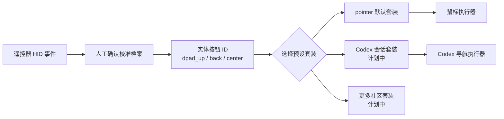

<!-- Copyright (c) 2026 FanXeon@Poemcoder with Codex -->

# 按键预设与默认指针模式

[English](BUTTON_PRESETS_EN.md) · [返回使用说明](USAGE.md) · [路线图](ROADMAP.md)

米遥把硬件识别和用户偏好分成两层：校准档案只回答“这个 HID Usage 是哪个实体按钮”，预设套装再决定“这个按钮现在做什么”。更换套装不需要重新校准遥控器。

> 当前状态：`pointer` 默认套装、校准合并、冲突拒绝、鼠标执行器和事件关联抑制已经实现并通过自动测试；完整六键真机校准与整套指针验收尚未完成，因此不能把指针模式标记为端到端验证。

## 映射架构



校准档案不会保存 `pointer.right_click` 一类动作。返回键在硬件层永远只是 `back`；它在 `pointer` 中可以是右击，在未来 Codex 套装中可以是取消或返回。

## 默认 `pointer` 套装

| 实体按钮 | 默认动作 | 当前门禁 |
| --- | --- | --- |
| 语音键 | `voice.push_to_talk` | 继续使用已验证 ATVV 语音链路 |
| 方向上 / 下 / 左 / 右 | `pointer.move_*` | 四项都必须人工确认 |
| 中间确认键 | `pointer.left_click` | 必须人工确认 |
| 返回键 | `pointer.right_click` | 物理 Usage `0x07/0xF1` 已确认；需按新档案格式再确认 |
| 音量加 / 减 | `pointer.scroll_up/down` | 可选增强，未确认时不影响六键基础模式 |
| `TV` | `pointer.toggle` | 可选增强 |
| `HOME` | `codex.focus` | 可选增强 |
| 菜单键 | `preset.cycle` | 当前只有一个套装时只提示状态 |
| 电源键 | `unmapped` | 默认不接管 |

基础指针模式要求 `dpad_up`、`dpad_down`、`dpad_left`、`dpad_right`、`center`、`back` 六项全部存在、均观察到按下与松手，而且 Usage 互不冲突。缺一项时，米遥只保留语音链路并明确打印缺失项。

## 首次校准

先停止正在运行的米遥，然后执行：

```bash
./scripts/debug-buttons.sh \
  --name "小米蓝牙语音遥控器" \
  --preset pointer
```

每次按键后使用：

- `回车` 或 `y`：确认实体按钮身份；
- `r`：丢弃并重测；
- `s`：跳过；
- `q`：保存此前已确认项目并结束。

也可以逐项校准，多个确认报告会按时间合并，最新结果覆盖同一个实体按钮的旧结果：

```bash
./scripts/debug-buttons.sh --name "小米蓝牙语音遥控器" --button dpad_up
./scripts/debug-buttons.sh --name "小米蓝牙语音遥控器" --button dpad_down
./scripts/debug-buttons.sh --name "小米蓝牙语音遥控器" --button dpad_left
./scripts/debug-buttons.sh --name "小米蓝牙语音遥控器" --button dpad_right
./scripts/debug-buttons.sh --name "小米蓝牙语音遥控器" --button center
./scripts/debug-buttons.sh --name "小米蓝牙语音遥控器" --button back
```

只有 `captureMode=confirmed_calibration` 的报告会进入运行时。自动学习报告、超时项、未观察到松手的项和两个按钮共用同一 Usage 的冲突档案都会被拒绝。

## 启动与回退

`pointer` 是默认套装，完成六项校准后仍使用日常命令：

```bash
./scripts/run.sh --name "小米蓝牙语音遥控器"
```

显式写法：

```bash
./scripts/run.sh \
  --name "小米蓝牙语音遥控器" \
  --preset pointer
```

只使用某一份完整确认档案：

```bash
./scripts/run.sh --button-profile "/path/to/buttons-*.json"
```

遇到风险或只想使用语音时：

```bash
./scripts/run.sh --name "小米蓝牙语音遥控器" --no-buttons
```

## macOS 安全边界

- 运行时只加载同 Vendor/Product 的人工确认档案；
- 指针动作需要辅助功能权限；权限或事件过滤器缺失时拒绝启动按键动作；
- macOS 普通用户进程无法在当前环境直接 seize 这支 HID 设备；米遥目前用 IOHID 来源事件与 Quartz 键盘事件做短时一次性关联，尝试拦截前台 App 收到的遥控器原始键；
- 过滤器当前只覆盖 Quartz `keyDown` / `keyUp`，Consumer Control、系统定义事件和不同固件的转换结果仍需真机验证；极端情况下，与遥控器几乎同时发生的 Mac 键盘事件也可能被误判，因此这不是已完成的安全隔离；
- 调试校准模式不会合成鼠标或键盘动作，但 macOS 仍可能处理遥控器原始 HID 键；请在无重要输入的窗口中校准；
- `Control + C` 始终是退出入口；`--no-buttons` 是明确的安全回退。

完整真机验收前，指针模式属于 **implementation preview**，语音链路仍是当前正式端到端能力。
