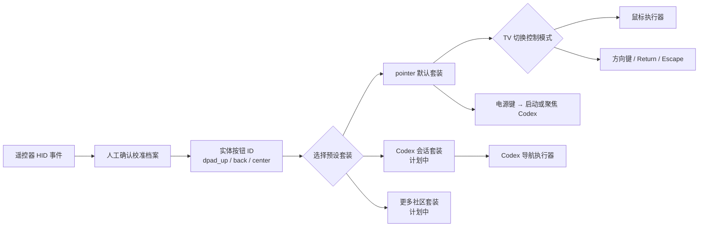

<!-- Copyright (c) 2026 FanXeon@Poemcoder with Codex -->

# 按键预设与默认指针模式

[English](BUTTON_PRESETS_EN.md) · [返回使用说明](USAGE.md) · [路线图](ROADMAP.md)

米遥把硬件识别和用户偏好分成两层：校准档案只回答“这个 HID Usage 是哪个实体按钮”，预设套装再决定“这个按钮现在做什么”。更换套装不需要重新校准遥控器。

> 当前状态：`pointer` 默认套装、校准合并、冲突拒绝和鼠标执行器已经实现并通过自动测试；小米 2 Pro 固件 2671 的六个必需按钮已完成新格式真机校准，四个方向已验证直接光标定位与真实坐标变化。点击、模式切换和电源动作仍需逐项验收，因此暂不把整套指针模式标记为端到端验证。

## 映射架构



校准档案不会保存 `pointer.right_click` 一类动作。返回键在硬件层永远只是 `back`；它在 `pointer` 中可以是右击，在未来 Codex 套装中可以是取消或返回。

## 默认套装与两种控制模式

| 实体按钮 | 默认动作 | 当前门禁 |
| --- | --- | --- |
| 语音键 | `voice.push_to_talk` | 继续使用已验证 ATVV 语音链路 |
| 方向上 / 下 / 左 / 右 | 鼠标：`pointer.move_*`；方向键：`keyboard.arrow_*` | 四项都必须人工确认 |
| 中间确认键 | 鼠标：`pointer.left_click`；方向键：`keyboard.return` | 必须人工确认 |
| 返回键 | 鼠标：`pointer.right_click`；方向键：`keyboard.escape` | 物理 Usage `0x07/0xF1` 已确认；需按新档案格式再确认 |
| 音量加 / 减 | `pointer.scroll_up/down` | 可选增强，未确认时不影响六键基础模式 |
| `TV` | `mode.toggle_pointer_directional` | `0x07/0x35` 已按新格式真机确认 |
| `HOME` | `codex.focus` | 可选增强 |
| 菜单键 | `preset.cycle` | 当前只有一个套装时只提示状态 |
| 电源键 | `codex.launch_or_focus` | Keyboard Power `0x07/0x66` 已按新格式真机确认 |

基础指针模式要求 `dpad_up`、`dpad_down`、`dpad_left`、`dpad_right`、`center`、`back` 六项全部存在、均观察到按下与松手，而且 Usage 互不冲突。缺一项时，米遥只保留语音链路并明确打印缺失项。

启动后默认是鼠标模式。按一下已校准的 `TV` 键切到方向键模式，再按一次切回。方向键模式适合在 Codex 或其他前台 App 中移动选择：方向四键发送标准箭头键，中间确认发送 Return，返回发送 Escape。音量、`HOME`、菜单、语音和电源动作不随控制模式改变。

小米 2 Pro 固件 2671 的 `TV` 与电源键已经分别确认成 Keyboard Usage `0x35` 和 Keyboard Power `0x66`，不是纯红外键。Codex 已运行时电源动作只聚焦现有窗口，未运行时通过 bundle ID `com.openai.codex` 查找并启动已安装 App。其他遥控器仍必须独立校准，不能沿用这组 Usage。

## 首次校准

先停止正在运行的米遥，然后执行：

```bash
./scripts/debug-buttons.sh \
  --name "小米蓝牙语音遥控器" \
  --preset pointer
```

每次按键后使用：

- `回车` 或 `y`：确认实体按钮身份；
- `r`：丢弃并重测；
- `s`：跳过；
- `q`：保存此前已确认项目并结束。

也可以逐项校准，多个确认报告会按时间合并，最新结果覆盖同一个实体按钮的旧结果：

```bash
./scripts/debug-buttons.sh --name "小米蓝牙语音遥控器" --button dpad_up
./scripts/debug-buttons.sh --name "小米蓝牙语音遥控器" --button dpad_down
./scripts/debug-buttons.sh --name "小米蓝牙语音遥控器" --button dpad_left
./scripts/debug-buttons.sh --name "小米蓝牙语音遥控器" --button dpad_right
./scripts/debug-buttons.sh --name "小米蓝牙语音遥控器" --button center
./scripts/debug-buttons.sh --name "小米蓝牙语音遥控器" --button back
./scripts/debug-buttons.sh --name "小米蓝牙语音遥控器" --button tv
./scripts/debug-buttons.sh --name "小米蓝牙语音遥控器" --button power
```

只有 `captureMode=confirmed_calibration` 的报告会进入运行时。自动学习报告、超时项、未观察到松手的项和两个按钮共用同一 Usage 的冲突档案都会被拒绝。

## 启动与回退

`pointer` 是默认套装。完成校准后推荐使用一键安全启动：

```bash
./scripts/run-with-mapping.sh --name "小米蓝牙语音遥控器"
```

这条命令按精确设备属性把方向六键、HOME、TV、电源和语音共十键映射为 HID `No Event`；菜单与音量加减不进入映射，保持原生。写入会回读验证，退出和信号中断都会安全恢复。

实现使用 macOS 内置 `hidutil UserKeyMapping`，编码方式和生命周期遵循 Apple 的 [TN2450: Remapping Keys](https://developer.apple.com/library/archive/technotes/tn2450/)。不安装内核扩展，不申请 DriverKit entitlement，也不修改全局键盘映射。

显式写法：

```bash
./scripts/run-with-mapping.sh \
  --name "小米蓝牙语音遥控器" \
  --preset pointer
```

只使用某一份完整确认档案：

```bash
./scripts/run-with-mapping.sh --button-profile "/path/to/buttons-*.json"
```

遇到风险或只想使用语音时：

```bash
./scripts/run.sh --name "小米蓝牙语音遥控器" --no-buttons
```

只读检查或恢复：

```bash
./scripts/remote-mapping.sh status
./scripts/remote-mapping.sh restore
```

## macOS 安全边界

- 运行时只加载同 Vendor/Product 的人工确认档案；
- 一键脚本只匹配 Vendor `0x2717` / Product `0x32B8` / 已验证产品名与 BLE transport；相同型号的第二支遥控器也可能被匹配；
- 应用前只接受空映射，拒绝覆盖任何既有 `UserKeyMapping`；状态文件记录所有权，恢复时同样拒绝删除未知配置；
- 指针动作需要辅助功能权限；权限缺失时拒绝启动按键动作；
- 米遥不建立全局 Quartz 键盘事件 tap，也不按时间窗口猜测事件来源，Mac 实体键盘不会进入米遥的按键处理链；
- 遥控器原生副作用只通过精确设备 service 的十键 HID `No Event` 映射隔离；`TV` / 电源键的物理 Usage 已确认，但动作结果仍需逐项真机验收；
- 调试校准模式不会合成鼠标或键盘动作，但 macOS 仍可能处理遥控器原始 HID 键；请在无重要输入的窗口中校准；
- `Control + C` 始终是退出入口；`--no-buttons` 是明确的安全回退。

左右击、模式切换和电源动作完成真机验收前，整套按键模式仍属于 **implementation preview**。
