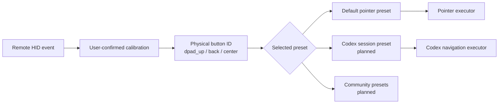

<!-- Copyright (c) 2026 FanXeon@Poemcoder with Codex -->

# Button Presets and the Default Pointer Mode

[中文](BUTTON_PRESETS.md) · [Usage](USAGE_EN.md) · [Roadmap](ROADMAP.md)

MI-AO separates hardware identity from user preference. A calibration profile answers “which physical button produced this HID Usage”; a preset decides “what that button does now.” Switching presets never requires recalibrating the remote.

> Current status: the default `pointer` preset, confirmed-profile merge, conflict rejection, pointer executor, and correlated event suppression are implemented and covered by automated tests. A complete six-button hardware calibration and end-to-end pointer run are still pending, so pointer mode is not yet marked hardware verified.

## Mapping architecture



The hardware profile never stores `pointer.right_click`. Back remains `back` at the hardware layer; a pointer preset can map it to right-click while a future Codex preset can map it to cancel.

## Default `pointer` preset

| Physical button | Default action | Gate |
| --- | --- | --- |
| Voice | `voice.push_to_talk` | Uses the verified ATVV voice path |
| D-pad | `pointer.move_*` | All four directions require confirmation |
| Center | `pointer.left_click` | Required |
| Back | `pointer.right_click` | Physical `0x07/0xF1` verified; new-format confirmation still required |
| Volume +/- | `pointer.scroll_up/down` | Optional enhancement |
| `TV` | `pointer.toggle` | Optional enhancement |
| `HOME` | `codex.focus` | Optional enhancement |
| Menu | `preset.cycle` | Reports the current preset while only one exists |
| Power | `unmapped` | Not handled by the default preset |

The base pointer preset requires confirmed press and release evidence for `dpad_up`, `dpad_down`, `dpad_left`, `dpad_right`, `center`, and `back`, with no duplicate Usage. If any item is missing, voice remains available and MI-AO prints the exact calibration gap.

## Calibrate

Stop MI-AO, then run:

```bash
./scripts/debug-buttons.sh \
  --name "小米蓝牙语音遥控器" \
  --preset pointer
```

Use Return/`y` to confirm, `r` to retry, `s` to skip, or `q` to save confirmed work and stop. Single-button sessions can be merged, so the six required buttons may be calibrated separately with `--button dpad_up`, `--button center`, and so on.

Only reports with `captureMode=confirmed_calibration` are eligible. Automatic learning, timeouts, missing release evidence, and duplicate Usage assignments are rejected.

## Run and recover

`pointer` is the default after a complete calibration:

```bash
./scripts/run.sh --name "小米蓝牙语音遥控器"
```

Use `--preset pointer` to be explicit, `--button-profile "/path/to/buttons-*.json"` to pin one complete report, or `--no-buttons` to keep only the voice path.

## macOS safety boundary

- Runtime profiles must be user-confirmed and match the remote Vendor/Product.
- Pointer actions require Accessibility permission; missing permission or a missing event filter disables button actions.
- A normal user process cannot seize this HID device in the current environment. MI-AO currently correlates IOHID source events with one-shot Quartz keyboard events in an attempt to stop the foreground app from receiving the remote's original key.
- The filter currently covers Quartz `keyDown` / `keyUp` only. Consumer Control, system-defined events, and firmware-specific conversion still need hardware verification. A nearly simultaneous Mac-keyboard event can also be misclassified, so this is not a completed isolation boundary.
- Calibration does not synthesize actions, although macOS may still handle the original remote HID key while calibration is running. Calibrate in a window with no important input.
- `Control + C` stops the bridge; `--no-buttons` is the explicit safe fallback.

Until the full hardware acceptance run is complete, pointer mode is an **implementation preview**. Voice remains the production end-to-end path.
