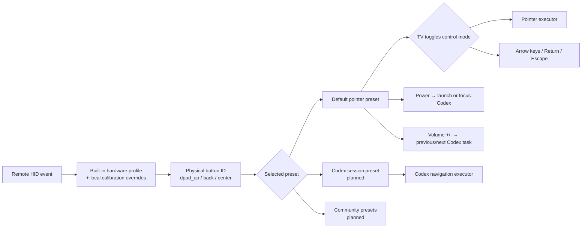

<!-- Copyright (c) 2026 FanXeon@Poemcoder with Codex -->

# Button Presets and the Default Pointer Mode

[中文](BUTTON_PRESETS.md) · [Usage](USAGE_EN.md) · [Roadmap](ROADMAP.md)

MI-AO separates hardware identity from user preference. A built-in hardware profile or local calibration answers “which physical button produced this HID Usage”; a preset decides “what that button does now.” Switching presets never requires recalibrating the remote.

> Current status: the default `pointer` preset, confirmed-profile merge, conflict rejection, and pointer executor are implemented and covered by automated tests. Xiaomi Remote 2 Pro firmware 2671 has complete new-format calibration for all twelve intercepted keys. All four directions passed direct cursor positioning and real-coordinate monitoring, and Volume Up/Down passed bidirectional Codex task navigation acceptance. HOME click arbitration, mode switching, and Power still need per-action acceptance.

## Mapping architecture



The hardware profile never stores an action such as `keyboard.escape`. Back remains `back` at the hardware layer; the default preset then interprets it as Escape.

## Default preset and its two control modes

| Physical button | Default action | Gate |
| --- | --- | --- |
| Voice | `voice.push_to_talk` | Uses the verified ATVV voice path |
| D-pad | Pointer: `pointer.move_*`; directional: `keyboard.arrow_*` | Firmware 2671 verified Usages are built in |
| Center | Always `keyboard.return` | Firmware 2671 verified Usage is built in |
| Back | Always `keyboard.escape` | Built-in firmware 2671 Usage `0x07/0xF1` |
| Volume +/- | `codex.previous_task/next_task` | `0x07/0x80`, `0x07/0x81`; bidirectional action accepted |
| `TV` | `mode.toggle_pointer_directional` | New-format hardware confirmation: `0x07/0x35` |
| `HOME` | One click: `keyboard.page_down`; double-click within 350 ms: `keyboard.page_up` | Single-click waits for the double-click window, so a double-click never emits Page Down first |
| Menu | Mouse right-click (native macOS behavior) | Excluded from the device neutralization map and not executed by MI-AO |
| Power | `codex.launch_or_focus` | New-format Keyboard Power confirmation: `0x07/0x66` |

The base pointer preset requires confirmed press and release evidence for `dpad_up`, `dpad_down`, `dpad_left`, `dpad_right`, `center`, and `back`, with no duplicate Usage. If any item is missing, voice remains available and MI-AO prints the exact calibration gap.

Startup defaults to pointer mode. A calibrated `TV` press switches to directional mode; press it again to return. **TV changes only the D-pad**: it moves the pointer in pointer mode and emits standard arrow keys in directional mode. Center always sends Return and Back always sends Escape; no other button changes with the mode.

On Xiaomi Remote 2 Pro firmware 2671, `TV` and Power are confirmed as Keyboard Usage `0x35` and Keyboard Power `0x66`; neither is infrared-only. Volume Up/Down are confirmed as `0x80` / `0x81` and invoke Codex's Previous Task / Next Task menu items directly through Accessibility. MI-AO does not synthesize `Cmd+Shift+[` / `Cmd+Shift+]` or any modifier for these actions. Power activates an existing Codex process or locates the installed `com.openai.codex` app and requests launch. Other remotes still require independent calibration and must not reuse these Usage values blindly.

## Custom button configurations

Open **Settings & Diagnostics → Button Configurations** in the app. The official `Default · Pointer` preset is always read-only so a safe baseline remains available; use **New** to start from it or **Duplicate** to start from the selected preset. User presets can be renamed and assign supported D-pad, Center, Back, HOME, Volume, TV, and Power buttons to built-in actions or a recorded standard keyboard shortcut.

Saved presets are written to:

```text
~/Library/Application Support/mi-ao/button-presets.json
```

MI-AO writes the document atomically with directory mode `0700` and file mode `0600`. A damaged document is quarantined as `button-presets.invalid-<UTC>.json` and the official default is loaded; a newer schema remains untouched and read-only in the GUI rather than being overwritten by an older app.

### TV preset transitions

TV in the default `pointer` preset still changes only the D-pad mode. A custom preset may select **Switch to another configuration** for TV and then choose a different saved target. A TV press switches to that target immediately, resets the D-pad to pointer mode, and persists that target as the current preset for the next launch. MI-AO refuses self-references, deleting a target still used by another preset, and saving a missing target.

### Shortcut safety boundary

- Voice remains hold-to-talk and Menu remains native macOS right-click; neither is customizable.
- A shortcut is triggered only through the calibrated, exact remote HID service. Physical Mac keyboard events never enter the MI-AO button path.
- `Cmd-Q`, `Cmd-Option-Escape`, and `Cmd-Control-Q` are rejected to avoid an accidental quit, force-quit panel, or lock screen.
- MI-AO presses modifiers before the target key and releases them in reverse order on release, safe exit, BLE-session stop, and runtime interruption so Option, Control, Command, and Shift cannot remain down.
- Saving posts a runtime notification and immediately reloads the catalog and selected preset without restarting the app.
- Test executes the row's current action exactly once; it does not pretend to be a physical remote event. Real highlighting comes only from runtime HID down/up notifications.
- Runtime actions also report to the menu bar: real direction, scrolling, keyboard, HOME, mode/preset, and Codex actions show matching monochrome symbols for about 1.2 seconds, without result colors or rounded backgrounds. Voice disconnect, reconnect, and Smart Sleep do not suppress HID feedback; active recording and safe shutdown retain priority.
- Export writes a private JSON file. Import accepts a regular file up to 1 MB and validates the entire catalog schema, button set, reserved buttons, TV targets, and shortcut safety before the user confirms replacement.

## Built-in profile and optional calibration

Xiaomi Remote 2 Pro firmware 2671 loads `Resources/HardwareProfiles/xiaomi-remote-2-pro-2671.plist` by default, so a clean install does not need a local report. The profile contains only verified device identity and physical Usages—never mouse or Codex actions.

If the same model behaves differently, the firmware differs, or another remote is being added, run:

Stop MI-AO, then run:

```bash
./scripts/debug-buttons.sh \
  --name "小米蓝牙语音遥控器" \
  --preset pointer
```

Use Return/`y` to confirm, `r` to retry, `s` to skip, or `q` to save confirmed work and stop. Single-button sessions can be merged, so buttons may be calibrated separately with `--button dpad_up`, `--button center`, and so on. Use `--button volume_up` and `--button volume_down` for Codex task navigation.

Only local reports with `captureMode=confirmed_calibration` can override the built-in profile. Automatic learning, timeouts, missing release evidence, and duplicate Usage assignments are rejected. Explicitly invalidating a required key makes preflight fail instead of silently returning to the built-in value.

## Run and recover

Use the safe one-command startup:

```bash
./scripts/start.sh
```

It runs `check-buttons` in the background, then generates the twelve-key HID `No Event` mapping from the same hardware profile used by the Swift runtime. Permission, profile, or runtime failure leaves the system unchanged. Menu is excluded and keeps the native macOS right-click. The wrapper verifies writes and restores after menu-bar safe exit, `stop.sh`, or signals. A second instance is rejected before any system change.

The implementation uses the built-in `hidutil UserKeyMapping` format and lifecycle documented in Apple's [TN2450: Remapping Keys](https://developer.apple.com/library/archive/technotes/tn2450/). It installs no kernel extension, requests no DriverKit entitlement, and changes no global keyboard mapping.

Use `--preset pointer` to be explicit or `--button-profile "/path/to/buttons-*.json"` to pin one complete report. Use the original `run.sh --no-buttons` command for voice without any mapping change. Inspect or recover with `remote-mapping.sh status` and `remote-mapping.sh restore`.

## macOS safety boundary

- The verified device starts from a Vendor/Product-matched built-in profile; local confirmed reports override it in time order.
- `check-buttons` must pass before neutralization, preventing a half-started state where macOS keys are blocked but MI-AO has no button runtime.
- The wrapper matches Vendor `0x2717`, Product `0x32B8`, the verified product name, and BLE transport. A second identical remote may also match.
- Apply accepts an empty mapping only and refuses to overwrite any existing `UserKeyMapping`. Ownership state gates restore so unknown user mappings are never deleted.
- Pointer actions require Accessibility permission; missing permission disables button actions.
- MI-AO installs no global Quartz keyboard event tap and never guesses an event source from timing. Events from the physical Mac keyboard do not enter MI-AO's button pipeline.
- Native remote side effects are isolated only by the twelve-key HID `No Event` mapping scoped to the exact device service. Menu keeps the native macOS right-click. HOME, `TV`, Power, and Volume have verified physical Usages, but new action results still require individual hardware acceptance.
- Calibration does not synthesize actions, although macOS may still handle the original remote HID key while calibration is running. Calibrate in a window with no important input.
- Menu-bar safe exit or `./scripts/stop.sh` is the daily stop path; use `Control + C` for foreground debugging. `--no-buttons` is the explicit safe fallback.

Until mode switching and Power complete hardware acceptance, the complete button mode remains an **implementation preview**.
