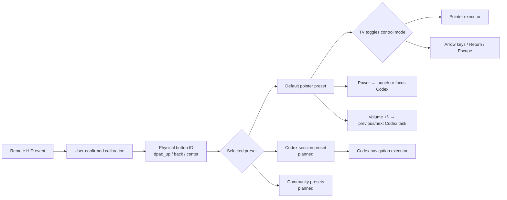

<!-- Copyright (c) 2026 FanXeon@Poemcoder with Codex -->

# Button Presets and the Default Pointer Mode

[中文](BUTTON_PRESETS.md) · [Usage](USAGE_EN.md) · [Roadmap](ROADMAP.md)

MI-AO separates hardware identity from user preference. A calibration profile answers “which physical button produced this HID Usage”; a preset decides “what that button does now.” Switching presets never requires recalibrating the remote.

> Current status: the default `pointer` preset, confirmed-profile merge, conflict rejection, and pointer executor are implemented and covered by automated tests. Xiaomi Remote 2 Pro firmware 2671 has complete new-format calibration for all twelve intercepted keys. All four directions passed direct cursor positioning and real-coordinate monitoring, and Volume Up/Down passed bidirectional Codex task navigation acceptance. HOME click arbitration, mode switching, and Power still need per-action acceptance.

## Mapping architecture



The hardware profile never stores an action such as `keyboard.escape`. Back remains `back` at the hardware layer; the default preset then interprets it as Escape.

## Default preset and its two control modes

| Physical button | Default action | Gate |
| --- | --- | --- |
| Voice | `voice.push_to_talk` | Uses the verified ATVV voice path |
| D-pad | Pointer: `pointer.move_*`; directional: `keyboard.arrow_*` | All four directions require confirmation |
| Center | Always `keyboard.return` | Required |
| Back | Always `keyboard.escape` | Physical `0x07/0xF1` verified; new-format confirmation still required |
| Volume +/- | `codex.previous_task/next_task` | `0x07/0x80`, `0x07/0x81`; bidirectional action accepted |
| `TV` | `mode.toggle_pointer_directional` | New-format hardware confirmation: `0x07/0x35` |
| `HOME` | One click: `keyboard.page_down`; double-click within 350 ms: `keyboard.page_up` | Single-click waits for the double-click window, so a double-click never emits Page Down first |
| Menu | Mouse right-click (native macOS behavior) | Excluded from the device neutralization map and not executed by MI-AO |
| Power | `codex.launch_or_focus` | New-format Keyboard Power confirmation: `0x07/0x66` |

The base pointer preset requires confirmed press and release evidence for `dpad_up`, `dpad_down`, `dpad_left`, `dpad_right`, `center`, and `back`, with no duplicate Usage. If any item is missing, voice remains available and MI-AO prints the exact calibration gap.

Startup defaults to pointer mode. A calibrated `TV` press switches to directional mode; press it again to return. **TV changes only the D-pad**: it moves the pointer in pointer mode and emits standard arrow keys in directional mode. Center always sends Return and Back always sends Escape; no other button changes with the mode.

On Xiaomi Remote 2 Pro firmware 2671, `TV` and Power are confirmed as Keyboard Usage `0x35` and Keyboard Power `0x66`; neither is infrared-only. Volume Up/Down are confirmed as `0x80` / `0x81` and invoke Codex's Previous Task / Next Task menu items directly through Accessibility. MI-AO does not synthesize `Cmd+Shift+[` / `Cmd+Shift+]` or any modifier for these actions. Power activates an existing Codex process or locates the installed `com.openai.codex` app and requests launch. Other remotes still require independent calibration and must not reuse these Usage values blindly.

## Calibrate

Stop MI-AO, then run:

```bash
./scripts/debug-buttons.sh \
  --name "小米蓝牙语音遥控器" \
  --preset pointer
```

Use Return/`y` to confirm, `r` to retry, `s` to skip, or `q` to save confirmed work and stop. Single-button sessions can be merged, so buttons may be calibrated separately with `--button dpad_up`, `--button center`, and so on. Use `--button volume_up` and `--button volume_down` for Codex task navigation.

Only reports with `captureMode=confirmed_calibration` are eligible. Automatic learning, timeouts, missing release evidence, and duplicate Usage assignments are rejected.

## Run and recover

After calibration, use the safe one-command startup:

```bash
./scripts/run-with-mapping.sh --name "小米蓝牙语音遥控器"
```

It maps D-pad, Center, Back, HOME, TV, Power, Voice, and Volume Up/Down—twelve keys total—to HID `No Event` for the exact device. Menu is excluded and keeps the native macOS right-click. The wrapper verifies writes and restores on normal exit or signals.

The implementation uses the built-in `hidutil UserKeyMapping` format and lifecycle documented in Apple's [TN2450: Remapping Keys](https://developer.apple.com/library/archive/technotes/tn2450/). It installs no kernel extension, requests no DriverKit entitlement, and changes no global keyboard mapping.

Use `--preset pointer` to be explicit or `--button-profile "/path/to/buttons-*.json"` to pin one complete report. Use the original `run.sh --no-buttons` command for voice without any mapping change. Inspect or recover with `remote-mapping.sh status` and `remote-mapping.sh restore`.

## macOS safety boundary

- Runtime profiles must be user-confirmed and match the remote Vendor/Product.
- The wrapper matches Vendor `0x2717`, Product `0x32B8`, the verified product name, and BLE transport. A second identical remote may also match.
- Apply accepts an empty mapping only and refuses to overwrite any existing `UserKeyMapping`. Ownership state gates restore so unknown user mappings are never deleted.
- Pointer actions require Accessibility permission; missing permission disables button actions.
- MI-AO installs no global Quartz keyboard event tap and never guesses an event source from timing. Events from the physical Mac keyboard do not enter MI-AO's button pipeline.
- Native remote side effects are isolated only by the twelve-key HID `No Event` mapping scoped to the exact device service. Menu keeps the native macOS right-click. HOME, `TV`, Power, and Volume have verified physical Usages, but new action results still require individual hardware acceptance.
- Calibration does not synthesize actions, although macOS may still handle the original remote HID key while calibration is running. Calibrate in a window with no important input.
- `Control + C` stops the bridge; `--no-buttons` is the explicit safe fallback.

Until mode switching and Power complete hardware acceptance, the complete button mode remains an **implementation preview**.
